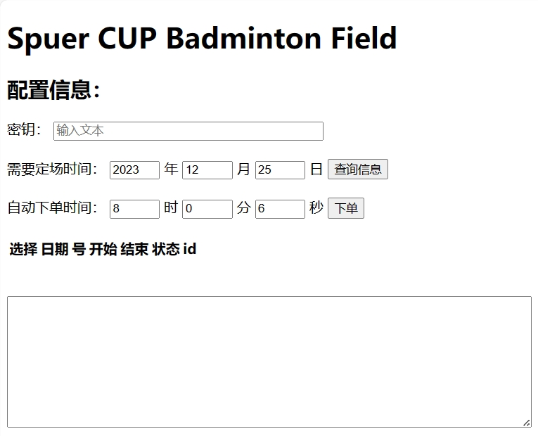
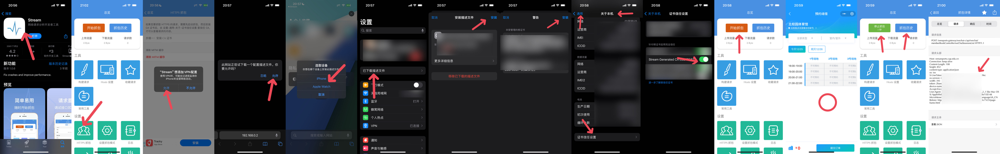
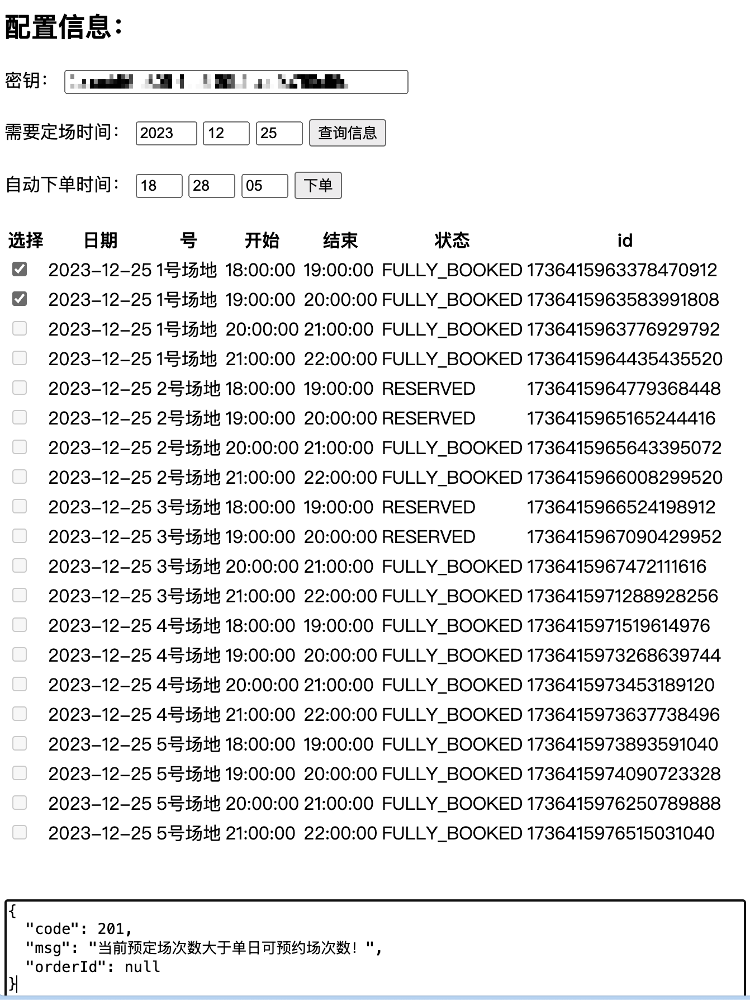

# Badminton-Field

## Key Words

微信小程序 场馆中心 体育场管理服务中心 羽毛球 脚本 抢场地 CUP

## Features

1. 可视化操作

2. 提前查看

3. 定时运行

4. Docker一键运行



## Quick-Started

不防呆不防傻，请严格按照流程操作，不按流程或填入“顾客进店点了-1/3份螺丝刀”等异常变量，可以逝世

一个demo而已，出现异常删除容器重启docker

1. 安装Dokcer

2. 打开cmd运行如下

   ```Bash
   git clone https://github.com/BigF25/Badminton-Field.git
   cd Badminton-Field
   docker build -t badminton-field .
   docker run -p 3005:3005 --rm  badminton-field
   ```

3. 打开[链接](http://localhost:3005/main.html)

4. 手机端获取token

   

5. 填入密钥

6. 选择要定的时间

7. 点击查询信息按钮

8. 勾选两个需要订的场地（禁止选择不同场地号） 没有进行防呆设计，但你可以逝世  记得选择状态为`NO_RESERVED`的行，这个表示场地在查询当时是没有人预定的

9. 选择脚本自动运行的时间，推荐8:00:06的配置

10. 点击下单按钮，系统会自动创建一个定时下单的脚本，到点自动下单

11. 显示如下结果表示抢购成功，进小程序个人订单界面付钱

      ```text
      {"code":200,"msg":null,"orderId":"00000000000000000"}
      ```

      不成功可能出现以下其一

      ```text
      {"code":201,"msg":"未到预定时间，请勿超期预定！","orderId":null}
      {"code":201,"msg":"场次:18:0-19:0已约满，请刷新!","orderId":null}
      {"code":500,"msg":"访问过于频繁，请稍后再试"}
      ```

12. 出现意外重启，请开启另一个终端，关闭容器

      ```Bash
      docker ps
      docker rm -f 'CONTAINER ID'
      ```

## 效果展示

   

## 仅供参考

🏸🏸🏸 enjoy!!

🏸🏸🏸 and f**k 15RMB per hour
